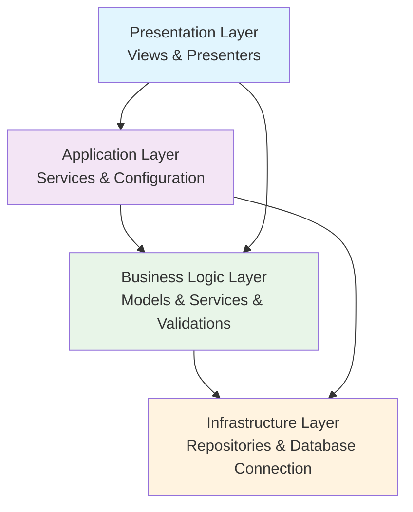

# Indoor Soccer Tournament Manager

Comprehensive management system for indoor soccer tournaments developed in C# with Windows Forms and SQL Server. Allows tournament administration from creation to completion, including team registration, player management, match scheduling, and statistics generation.

## Description

This system was designed to solve the organizational challenges faced by the Sports Committee of the Municipality of San Carlos in managing indoor soccer tournaments across different communities and districts. The application provides an intuitive and incremental approach to tournament management, following a clear and organized workflow.

### Key Features

- **Tournament Management**: Create and manage tournaments by age and gender categories
- **Team Registration**: Support for up to 12 players per team with age validation
- **Match System**: Automatic pairing for regular phase and final phase
- **Statistics Generation**: Position tables, top 10 scorers, and sanctions registry
- **Multi-role System**: Administrator, Sub-administrator, and Referee with differentiated permissions
- **Comprehensive Reporting**: Detailed statistics and tournament progress tracking

## Academic Context

**Course**: ISW 411 - Interface Workshop  
**Period**: II Semester 2025  
**Institution**: Universidad Técnica Nacional (UTN)  
**Instructor**: Dawer Alfaro Solís  
**Project Value**: 40% of final grade  
**Due Date**: August 26, 2025

### Academic Objectives

1. Develop efficient tournament management software
2. Facilitate registration and tracking of participating teams
3. Implement an equitable and hierarchical participation system
4. Provide tools for statistics generation

## System Requirements

### Development Environment
- **IDE**: Visual Studio
- **Framework**: .NET Framework
- **UI**: Windows Forms
- **Database**: SQL Server
- **Language**: C# 

### Hardware Requirements
- Windows OS compatible machine
- Minimum 4GB RAM
- SQL Server compatible system
- .NET Framework runtime

### Database Requirements
- SQL Server (Local or Remote)
- Database normalized to Third Normal Form
- No stored procedures or triggers required (data handling through C#)

## Architecture

### Layers and Purpose

#### 1. Presentation Layer (Views & Presenters)
**Purpose**: Handles all user interface interactions and displays data to users
- **Views**: Windows Forms that present information and capture user input
- **Presenters**: Manage the communication between views and business logic, implementing the MVP pattern

#### 2. Application Layer
**Purpose**: Orchestrates application flow and manages cross-cutting concerns
- **Configuration**: Environment variables management and application settings
- **Input Validation**: Initial data validation and sanitization

#### 3. Business Logic Layer
**Purpose**: Contains the core business rules and domain logic
- **Models**: Domain entities and business objects (Tournament, Team, Player, Match)
- **Services**: Business operations and tournament management logic
- **Validations**: Business rule enforcement and data integrity checks

#### 4. Infrastructure Layer
**Purpose**: Provides technical capabilities and external system integration
- **Database Connection**: SQL Server connectivity and connection management
- **Repositories**: Data access patterns and database operations
- **External Services**: Integration with external systems if needed

### Dependency Flow



### Data Flow Process
1. **Presentation Layer**: Captures user interactions through Windows Forms
2. **Application Layer**: Coordinates operations and validates input
3. **Business Logic**: Applies tournament rules and business validations
4. **Infrastructure Layer**: Persists data to SQL Server database

## Folder Structure

```
GestorTorneosFutbolSala/
├── src/
│   ├── Presentation/
│   │   ├── Views/              # Windows Forms UI
│   │   └── Presenters/         # MVP Pattern presenters
│   ├── Application/
│   │   └── Configuration/      # Environment variables & settings
│   ├── Business/
│   │   ├── Models/             # Domain entities
│   │   ├── Services/           # Business logic services
│   │   └── Validations/        # Business rule validations
│   ├── Infrastructure/
│   │   ├── Data/               # Database connection
│   │   └── Repositories/       # Data access repositories
│   └── Resources/              # Images, icons, assets
├── database/
│   ├── scripts/                # SQL creation scripts
│   └── samples/                # Sample data
├── docs/
│   ├── technical-report.pdf    # Technical documentation
│   └── user-manual.pdf         # User guide
└── README.md
```

## Installation

### Clone Repository

```bash
git clone https://github.com/alejandrosandi22/GestorTorneosFutbolSala.git
cd GestorTorneosFutbolSala
```

### Environment Variables

Create a `.env` file in the root directory:

```env
DB_CONNECTION_STRING="your_database_connection_string"
```

**Environment Variables to set:**
- `DB_CONNECTION_STRING`: Complete database connection string for SQL Server

### Database Setup

1. Install SQL Server (Express or full version)
2. Run the database creation scripts in `/database/scripts/`
3. Optionally load sample data from `/database/samples/`

### Build and Run

1. Open the solution in Visual Studio
2. Restore NuGet packages
3. Build the solution (Ctrl+Shift+B)
4. Run the application (F5)

## Version Control

### Branch Convention

Follow the pattern: `<type>/<task-description>`

**Types:**
- `feature/` - New features
- `bugfix/` - Bug fixes
- `hotfix/` - Critical fixes
- `refactor/` - Code refactoring
- `docs/` - Documentation updates

**Examples:**
- `feature/tournament-creation`
- `bugfix/player-age-validation`
- `refactor/database-connection`

### Commit Convention

Format: `<description>` `[body]` `[footer]`

**Examples:**
```
Tournament creation form with validation

- Implemented age category validation
- Added gender category selection
- Included year validation logic

Closes #123
```

```
Player registration age validation bug fix

The age calculation was incorrect when player birthday
was in the current year but hadn't occurred yet.

Fixes #456
```

## Documentation

- **Technical Report**: Located in `/docs/technical-report.pdf`
- **User Manual**: Available in `/docs/user-manual.pdf`
- **Code Documentation**: Inline comments following C# XML documentation standards
- **Database Schema**: ERD diagrams in `/docs/database/`

## Important Notes

### Tournament Logic
- **Regular Phase**: All teams play against each other (home and away)
- **Final Phase**: Top 4 teams compete, with top 2 playing the final
- **Points System**: Win = 3 points, Draw = 1 point, Loss = 0 points
- **Tiebreakers**: Goals scored, then alphabetical order

### Sanctions System
- Yellow Card: ₡10,000
- Blue Card: ₡15,000  
- Red Card: ₡25,000
- 5 Yellow Cards: Additional ₡30,000 penalty

### Player Restrictions
- Maximum 12 players per team (5 starters + 7 substitutes)
- Age validation against tournament category
- No player can exceed tournament age limit

## Contributors

- [Alejandro Sandí](https://github.com/alejandrosandi22)
- [Kristel Paniagua](https://github.com/Kris-paniagua)

## License

This project is for academic use only.
